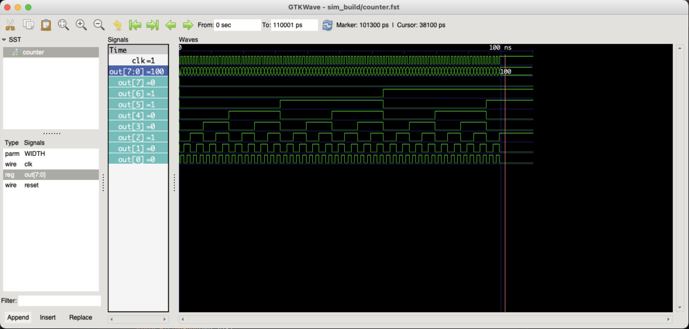

# Опсиание теста
В тесте используется простой счетчик, находящийся в файле counter.v:
```verilog
module counter(out, clk, reset);

  parameter WIDTH = 8;

  output [WIDTH-1: 0] out;
  input 	       clk, reset;

  reg [WIDTH-1: 0]   out;
  wire 	       clk, reset;

  always @(posedge clk or posedge reset)
    if (reset)
      out <= 0;
    else
      out <= out + 1;

endmodule // counter
```

Его testbench сделать с использованием Cocotb как:
```python
import cocotb
from cocotb.triggers import Timer


async def generate_clock(dut):
    for cycle in range(100):
        dut.clk.value = 0
        await Timer(0.5, units="ns")
        dut.clk.value = 1
        await Timer(0.5, units="ns")


@cocotb.test()
async def test(dut):
    dut.out.value = 0
    await cocotb.start(generate_clock(dut))
    await generate_clock(dut)

    await Timer(10, units="ns")

    assert dut.out.value == 100
```

Функция generate_clock переключает clk каждые 0.5 нс, чтобы обеспечить период 1 нс. Сначала выставляется нулевое значение счетчика, после чего запускается 100 периодов clock и проверяется, что значение счетчика также равно 100.

# Makefile
```bash
# defaults
SIM ?= icarus
TOPLEVEL_LANG ?= verilog

VERILOG_SOURCES += $(PWD)/counter.v
# use VHDL_SOURCES for VHDL files

# TOPLEVEL is the name of the toplevel module in your Verilog or VHDL file
TOPLEVEL = counter

# MODULE is the basename of the Python test file
MODULE = test

# include cocotb's make rules to take care of the simulator setup
include $(shell cocotb-config --makefiles)/Makefile.sim
```

# make_and_gtk
Скрипт make_and_gtk собирает проект и запускает gtkwave по результатам.

# Результат


# Запуск теста
```bash
./make_and_gtk
```
